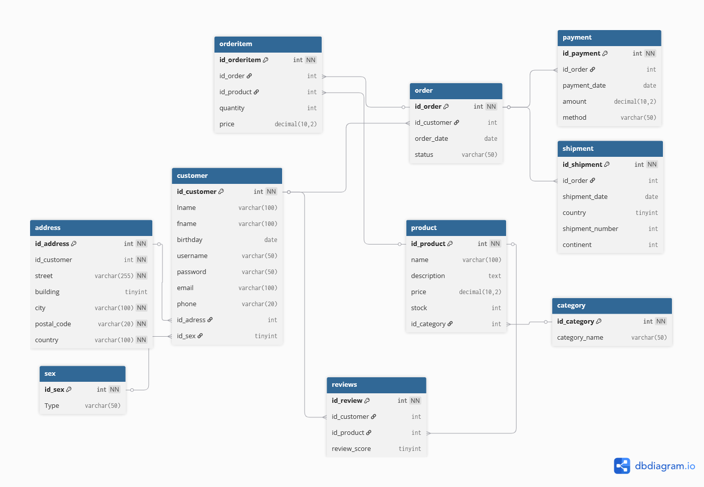

# 'Set Theorists E-Shop' Database System (MySQL)

This project is a relational database design for an online store (e-commerce) management system implemented in MySQL.  
It was developed as part of a university database course and models the core functionality of an e-shop, including customers, products, orders, payments, shipments, and reviews.

The system demonstrates database design principles such as primary keys, foreign keys, normalization, and relational integrity.

---

## Features

- Customer registration and profile management
- Product catalog with categories, pricing, and stock
- Order creation with multiple products
- Payment tracking
- Shipment and delivery information
- Product reviews and ratings
- Address management
- Order status monitoring

---

## Technologies

- MySQL
- SQL
- Relational Database Design
- ER Modeling

---

## Database Entities

### Customer
- id_customer (PK)
- lname
- fname
- birthday
- username
- password
- email
- phone
- id_address (FK)
- id_sex (FK)

### Sex
- id_sex (PK)
- type

### Address
- id_address (PK)
- id_customer (FK)
- street
- building
- city
- postal_code
- country

### Product
- id_product (PK)
- name
- description
- price
- stock
- id_category (FK)

### Category
- id_category (PK)
- category_name

### Order
- id_order (PK)
- id_customer (FK)
- order_date
- status

### ItemsOrdered
- id_itemsordered (PK)
- id_order (FK)
- id_product (FK)
- quantity
- price

### Payment
- id_payment (PK)
- id_order (FK)
- payment_date
- amount
- method

### Shipment
- id_shipment (PK)
- id_order (FK)
- id_address (FK)
- shipment_date
- shipment_number
- country
- continent

### Review
- id_review (PK)
- id_customer (FK)
- id_product (FK)
- review_score

---

## ER Diagram

---

## How to Run
TBA

---

## Example Queries

- Cities ranked by total customer spending
- High-value customers (spent over €500)
- Order shipment details
- Monthly sales analysis
- Average items per order
- Customer purchase history with product details and total cost

## License

This project is licensed under the MIT License.
